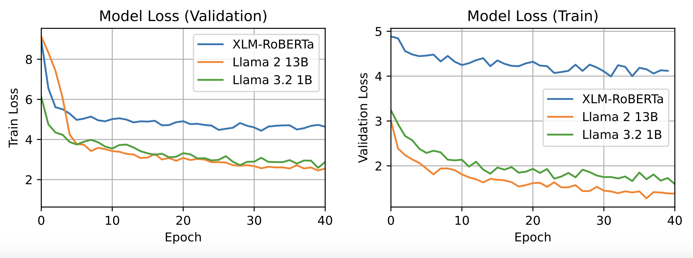
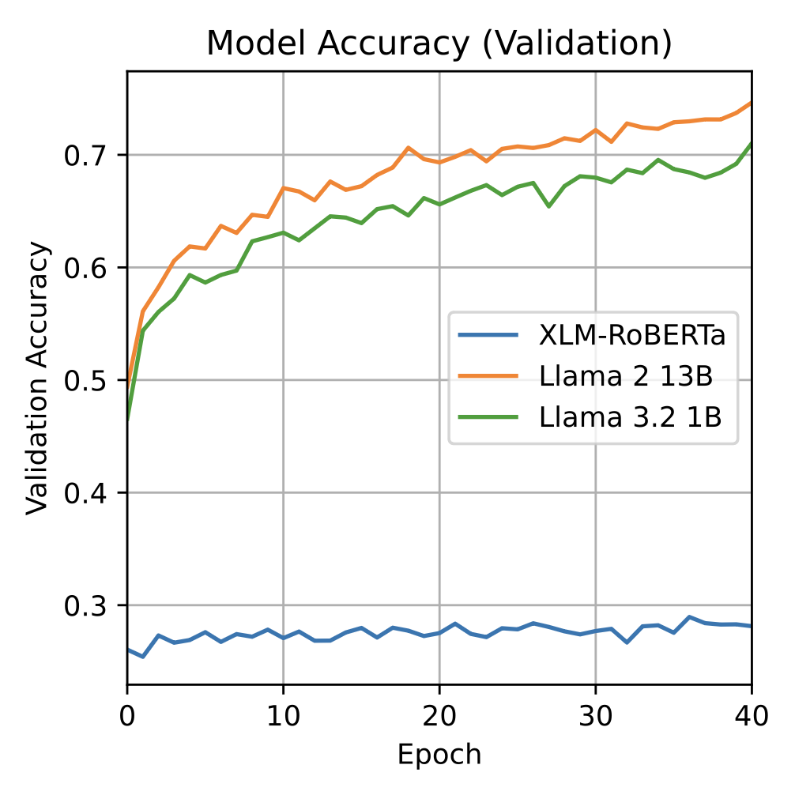

# Fine-tuning LLMs for Akkadian Text Restoration

### Abstract
Recent approaches for the restoration of cuneiform texts primarily use BERT-based encoder LLMs which perform masked language modelling. But recent studies have demonstrated that decoder LLMs provide superior performance on tasks typically reserved for encoders such as classification and sentence embedding. We demonstrate that decoder LLMs can be repurposed for masked language modeling by first disabling the causal mask and then fine-tuning the model with masked next token prediction. Our best model achieves 74\% accuracy on the completion of missing words in a dataset of transliterated Akkadian texts, increasing upon the 29\% achieved by the comparable encoder model XLM-RoBERTa.

### Introduction

Many historic documents from ancient Mesopotamia (ca. 2500 B.C. - 100 A.C) exist as inscribed cuneiform on clay tablets. Due to natural and human causes, these tablets are usually fragmented or damaged in some way. The motivation of this work is to contribute to ongoing efforts to restore missing Akkadian inscriptions using a predictive algorithm.

A long-standing approach for predicting missing words is masked language modeling (MLM). Encoder-based models such as BERT are trained using MLM, and naturally, BERT models have been used for text restoration tasks. Recently, decoder models have received immense attention because of their improved scalability over encoder models for language generation and open-source LLMs including those in the Llama and Deepseek families provide the research community with state-of-the-art language generation. However, these models are limited in MLM tasks. Fortunately, many techniques have focused on enabling these models to be adapted for downstream tasks other than language generation. BehnamGhader et al. adapt pre-trained decoder LLMs for document embedding \cite{behnamghaderllm2vec}. The authors fine-tune the model using contrastive learning and a novel fine-tuning task which they call masked next token prediction. We hypothesize that masked next token prediction task closely aligns with the objective of text restoration.

### Related Work

A key issue with the use of auto-regressive models in text restoration is that in-place token prediction cannot benefit from the proceeding tokens due to the causal mask necessary for training. Jon et al. address this issue through the use of several prompt-based approaches and achieve a maximum accuracy of 22.1\% \cite{jon2025finetuning}. Fetaya et al. examine unidirectional and bidirectional LSTMs for Akkadian text restoration and find that bidirectional context improves performance \cite{Fetaya2020RestorationOF}. More recently, Lazar et al. demonstrated that fine-tuning a transformer-based model, Multilingual BERT (M-BERT) specifically, improves upon an LSTM-based approach \cite{Lazar2021FillingTG}.

### Approach

We propose an approach for Akkadian text restoration by fine-tuning a pre-trained multilingual decoder transformer on a corpus of transliterated texts. We fine-tune the model using a masked next token prediction objective after causal mask removal.

Because the model architecture includes a causal mask in each layer, we remove the mask to enables bidirectional attention. Removing the causal mask allows for token prediction to benefit from conditioning on both the left- and right-directed contexts. BenhamGhader et al. have shown state-of-the-art results on contrastive or MLM tasks when applying this method \cite{behnamghaderllm2vec}. We make use of their existing implementation removing the causal masks.

Next, the model is trained using masked next token prediction (MNTP), which is largely similar to the masked language modeling (MLM) objective used to train BERT \cite{devlin2019bert}. MNTP acts on sequences by corrupting 15\% of tokens chosen at random, then predicting the correct value of the corrupted token given the rest of the sequence. Following the implementation of MLM in BERT, 80\% of corrupted tokens are replaced with a masking token, 10\% are replaced with a random word in the vocabulary, and the remaining 10\% are left unchanged. 

As an unsupervised learning objective, MNTP trains the model to produce probabilities for each word in the vocabulary. The key difference between MNTP and MLM is that MNTP uses the logits of the token prior to the masked token to predict the masked token. This difference closely aligns the new objective with the autoregressive pre-training of the decoder model. During each batch, we compute cross-entropy loss using these logits. We set the label of every other index to -100, which signals to PyTorch to ignore loss computation for uncorrupted tokens.

### Experiments

We conducted experiments with two decoder models from the Llama family to validate our approach. We selected Llama 2 13B and Llama 3.2 1B. Llama 3.2 is trained on a multilingual corpus, while Llama 2 is trained purely on English. These two models were chosen based on resource constraints, as some models were too large to fit on our GPUs. For comparison, we also include XLM-RoBERTa, a multilingual BERT-like encoder transformer, which we fine-tune using MLM.

### Dataset

Our dataset is sourced from the EvaCun 2025 shared task \cite{gordin2025evacun}. The dataset consists of phonetic transliterations of Akkadian words composed by experts. No data preprocessing was performed for comparison with the existing method \cite{jon2025finetuning}. The dataset contains 22,777 documents with a total of 913k words. We reserve 300 of these for our validation split and the rest are used for training.

The dataset also denotes sections of the text where words are missing, corresponding to genuine loss of information. We handle these areas by inserting a padding token and disabling attention on these areas as a means to preserve positional information.

### Training

We train our models with quantized low-rank adaptation (QLoRA) using the $peft$ library \cite{dettmers2023qlora}. QLoRA reduces the resource requirements of model fine-tuning by freezing the weights of the pre-trained LLM and then injecting trainable weights into each transformer layer. The frozen weights are additionally quantized from floating point to NF4 format, further reducing the memory required for computing forward passes through the LLM. QLoRA has previously been used in adaptation to low-resource languages \cite{toraman2024adapting}.

We configure QLoRA using $r=128$ and $\alpha=512$. For model training we use batch size of 1 with a learning rate of $lr=1e-5$, linear scheduler with 1000 warmup steps, and weight decay of 0.01. We trained the model for approximately 6.5 epochs on a NVIDIA H100 (Fig. \ref{fig:loss}). Training time increased with model size and the largest model (Llama 2 13B) required 38 hours of training.

### Evaluation

The metric we use to evaluate the performance of our model is accuracy. Accuracy is defined as the number of correctly predicted tokens out of the total number of predictions. Due to time constraints, we were unable to evaluate our model on the evaluation data provided by the EvaCun workshop, so all performance is reported on the validation dataset.

### Results

We find that decoder models perform better than encoder models in missing token prediction.

Model | Accuracy
------|---------
Llama 2 13B | 73.72
Llama 3.2 1B | 69.20
XLM-RoBERTa | 28.95

Table \ref{tab:acc} reports the accuracy achieved by all three models. Llama 2 13B performs the best and achieves 73.72\% accuracy. Both Llama models achieve relatively similar performance, with the larger model achieving a 6.5\% increase in accuracy over the smaller model. Meanwhile, XLM-RoBERTa achieves a maximum accuracy of 28.95\%.

### Discussion

Our results indicate that current LLM architecture can be adapted to specialized tasks typically performed by encoder transformers and performs better. Low-resource languages, such as Akkadian, can benefit from the transfer learning abilities of these large models. While we expected a positive improvement in performance from the LLama models over XLM-RoBERTa, the improvement in accuracy is incredibly large. The performance of the 13 billion parameter Llama model over the 1 billion parameter Llama model demonstrates the benefit of a larger number of model parameters. However, XLM-RoBERTa contains roughly half of the number of parameters as the smaller Llama model, however the performance penalty is severe despite being of similar order of magnitude. This points to architectural differences, and more analysis should be done to understand why there is such a large gap in performance.

Our accuracy is much higher than that of Jon et al. \cite{jon2025finetuning}. There are multiple potential reasons for this. First, prompt-based fine-tuning as a means of predicting missing tokens may add a considerable amount of noise to training because the context contains excess tokens which are not relevant to the underlying objective. Second, the authors do not mention gaps in the dataset. Because the gaps are encoded as skipped indices in the training dataset, it is possible that this aspect was missed, which wold lead to a degradation of the dataset. Additionally, the authors train all models for less than an epoch as they found diminishing performance. Using MNTP, we are able to train for at least 6.5 epochs without experiencing issues with training.

### Conclusion

We demonstrate a novel technique for Akkadian text restoration. There are many potential additions to our approach, including stronger pre-processing that is informed by domain experts. Future work should attempt to replicate the results of Jon et al. \cite{jon2025finetuning}. Differences in tokenization may affect accuracy. Including mean reciprocal rank would provide more insight into the performance of the models by directly evaluating the probability score of the correct token. Finally, testing a representative set of multilingual models would help form a stronger discussion on language transfer and low-resource abilities of decoder LLMs.